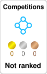

# 👋 Welcome to syun88's GitHub Profile | syun88のGitHubプロフィールへようこそ！

こんにちは！syun88です。東京工科大学（TUT）で人工知能を専攻しているコンピュータサイエンスの学生です。  
ロボティクス、AI、ゲーム開発に情熱を持ち、技術を駆使して現実の課題を解決することを目指しています。  
ROS2を活用したロボット開発や、Unityによるゲーム制作、そして深層学習を用いたエッジAIの研究を進めています。  
技術を学びながら成長していく過程を共有していきたいと思っています！リポジトリをチェックしたり、X (Twitter) でも気軽に交流してください！  

---

## 🌱 Currently Learning | 現在学んでいること
- 🌟 **AI & Machine Learning** (Python, Speech Recognition, Anomaly Detection, Transformers)  
- 🤖 **Robotics** (ROS2, Gazebo, Behavior Trees, SLAM, Navigation, Control Systems)  
- 🎮 **Game Development** (Unity, C#, SwiftUI, Game AI)  
- 🔍 **Edge AI & Embedded Systems** (Jetson Nano, Spresense, TinyML, TensorFlow Lite)  

---

## 🛠️ Skills | スキル
- **Programming Languages**: Python, C#, Swift, C++  
- **AI/ML Tools**: TensorFlow, PyTorch, Transformer, DL, ML  
- **Robotics**: ROS2, Gazebo, Behavior Trees, SLAM, Navigation, Teleop Control  
- **Development Tools**: Docker, Git, Firebase, GCP, AWS  
- **Game Engines**: Unity, SwiftUI  

---

### **📜 Certifications | 資格・認定**
- 🏅 **[NVIDIA Jetson AI Specialist](https://github.com/syun88/syun88/blob/main/NVIDIA-Jetson-AI-Specialist-Certificate-Jung-Ming-Chen.pdf)**  

## 🏆 Kaggle Achievements | Kaggleでの実績
- まだ初心者です！
- My Kaggke URL | Kaggleでのリンク https://www.kaggle.com/chenjungming

---

## 🌐 Find me on SNS |　他のSNS情報
- 🐙 **GitHub**: [syun88](https://github.com/syun88)  
- 📝 **Qiita**: [syun88](https://qiita.com/syun88)  
- 🐦 **X (Twitter)**: [@syun88AI](https://x.com/syun88AI)  
- linkedin **linkedin**: [CHENJUNGMING](https://www.linkedin.com/in/jungming-chen-733703354/)
---

## 📈 GitHub Stats | GitHub統計

  

  

  

  

---

## 📌 Profile & Contributions

  <picture>
    <source media="(prefers-color-scheme: dark)" srcset="output/metrics.base.svg" width="400" />
    <source media="(prefers-color-scheme: light)" srcset="output/metrics.base.svg" width="400" />
    
  </picture>

  <picture>
    <source media="(prefers-color-scheme: dark)" srcset="profile-3d-contrib/profile-night-rainbow.svg" width="700" />
    <source media="(prefers-color-scheme: light)" srcset="profile-3d-contrib/profile-season-animate.svg" width="700" />
    
  </picture>

---

### よろしくお願いします  
興味のある方はぜひフォロー＆DMしてください！技術について語り合いましょう！🚀  
